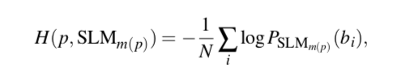

A Snapshot Language Model for Zooniverse Projects
========================================================
author: Corey Jackson
date: May 2, 2018
autosize: true

Overview
========================================================

**Goal**: Understand how language evolves in citizen science communities. 

**Method**: Given a post p, we can then quantify how surprising its language is with respect to the lan- guage the community was using at the point in time when it was written by calculating p’s cross-entropy according to the snapshot language model SLMm(p) of the month m(p) in which the post was uttered; we write this as:



<font size = "4.5px">
Cristian Danescu-Niculescu-Mizil, Robert West, Dan Jurafsky, Jure Leskovec, and Christopher Potts. 2013. No country for old members: user lifecycle and linguistic change in online communities. In Proceedings of the 22nd international conference on World Wide Web (WWW '13). ACM, New York, NY, USA, 307-318. DOI: https://doi.org/10.1145/2488388.2488416
</font>


========================================================
## Gravity Spy Dataset

<font size = "4.5px">
Gravity Spy Comments: 52,133  
Bi-grams: 477,851  
Users: 2,227  
Months: 24  (2016-03-01 to 2018-02-01)
</font>

## Caveats
<font size = "4.5px">
Unigrams removed  
Month 1 has one user  
Model begins prior to launch
</font>

***


   
Step 1: Bi-grams Dataset
========================================================
- Generate bigrams for each comment. 
- Subset comments by month resulting in 24 dataframes.

<font size = "5px">

```r
month2_single[,c(13:15)][628:635,]
```

```
    comment_user_login  comment_created_at               bigram
628             greggk 2016-04-04 23:34:24      within receiver
629             greggk 2016-04-04 23:34:24 receiver environment
630             greggk 2016-04-04 23:34:24     environment imho
631             greggk 2016-04-04 23:37:48        another image
632             greggk 2016-04-04 23:37:48      image modulated
633             greggk 2016-04-04 23:37:48        modulated 128
634             greggk 2016-04-04 23:37:48               128 hz
635             greggk 2016-04-04 23:37:48             hz chirp
```
</font>

Step 2: Computing Probabilities
========================================================
- Aggregated dataframes to get the number of times each bigram occurred, probability, and log(probability) of each bigram occuring during that month.  
- Proability computed as `length(bigram)/nrow(month3)` which is the number of times the bigram appears in the month divided by the total number of unique bigrams.

<font size = "5px">

```r
month2_probability <- month2 %>% group_by(bigram) %>%
  summarize(occurrence=length(bigram),
            probability_occur = length(bigram)/nrow(month2),
            log_probability_occur = log(probability_occur))
```
</font>

<font size = "5px">

```r
month2_probability[,c(2:5)][59:65,]
```

```
           bigram occurrence probability_occur log_probability_occur
59     120hz like          1      0.0001897533             -8.569786
60         128 hz          5      0.0009487666             -6.960348
61  128hz nothing          1      0.0001897533             -8.569786
62 128hz probably          1      0.0001897533             -8.569786
63          13 hz          1      0.0001897533             -8.569786
64          15 20          2      0.0003795066             -7.876638
65     15 energie          1      0.0001897533             -8.569786
```
</font>

Step 3: Aggregating Month 2 Probabilities Given Month 3
========================================================
<font size = "5px">
- Below shows the merged month 3 bigrams merged with month 2
- Those with a 0 value for `probability_occur` are new bigrams
- `occurrence` indicates how many times that bigram appeared in the previous month (not the current)
</font>

<font size = "5px">

```r
month3_p <- merge(month3_single,month2_probability, by=("bigram"),all.x=TRUE)
month3_p[ , 15:17][is.na(month3_p[ , 15:17] ) ] = 0
month3_p$month <- "Month 3"
```
</font>

<font size = "4px">

```
         bigram discussion_id comment_user_login occurrence
1    0 scratchy         53345         EcceruElme          0
2    1 vertical         54573         EcceruElme          0
3     100 400hz         54573         EcceruElme          0
4        128 hz         54573         EcceruElme          5
5  12p mirrored         54573         EcceruElme          0
6 17p different         54573         EcceruElme          0
  probability_occur log_probability_occur
1      0.0000000000              0.000000
2      0.0000000000              0.000000
3      0.0000000000              0.000000
4      0.0009487666             -6.960348
5      0.0000000000              0.000000
6      0.0000000000              0.000000
```
</font>

Analysis
========================================================

<font size = "4.5px">
- Individual user language
  - How is the language of users evolving to resemble/depart from community?
- Thread level analysis. 
  - Are there lengthy discussions which have high entropy
  - Changes in entropy by month...are users adding new content to threads?
</font>

<font size = "4.5px">

```
       X1 comment_user_login bigram_count  probability    month
36     36             PetMor           26 0.000000e+00  Month 2
53     53             PetMor            1 0.000000e+00  Month 3
105   105             PetMor           21 2.139483e-04  Month 6
157   157             PetMor            2 1.966665e-04  Month 7
852   852             PetMor           76 1.009231e-04 Month 11
1014 1014             PetMor            3 0.000000e+00 Month 12
1185 1185             PetMor           14 2.404919e-05 Month 13
1346 1346             PetMor            9 2.326412e-04 Month 14
1465 1465             PetMor           17 4.549886e-04 Month 15
1591 1591             PetMor            5 0.000000e+00 Month 16
1688 1688             PetMor            5 2.694045e-04 Month 17
1768 1768             PetMor           19 2.464558e-05 Month 18
1859 1859             PetMor            5 1.760932e-03 Month 19
```
</font>


Future Work
========================================================

- Dhruv working on visualizing evolution
- Mabi exploring more complex model which might be included in Trajectories Analysis, but share some similarity
- Open source [code](snapshot-model.R) to run across many Zooniverse projects 


